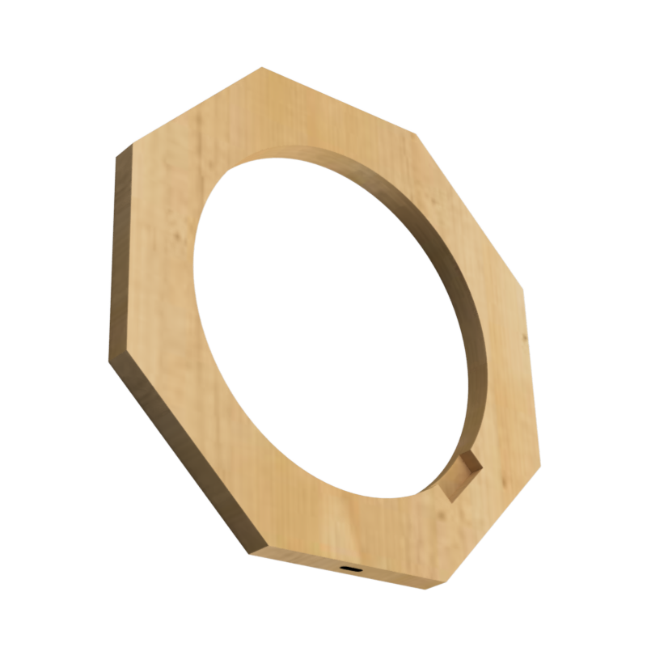

# CAD data for DigitalClock

This folder contains the CAD, STL and drawing files for the DigitalClock parts.
The CAD files can be edited with Autodesk Fusion 360.

Parts:

- **digitalclock_7segment_grid**: Printed with a 3D printer, using the settings below
- **digitalclock_backside**: Cut from 3mm plywood with a jigsaw.
- **digitalclock_frame**: Cut from 18mm wooden board witha a jigsaw.
- **digitalclock_front**: The 3mm acrylic plate was already ordered in correct shape.

## Printer Settings

To ensure optimal printing results, please use the following printer settings:

- Filament: Black PLA
- Nozzle diameter: 1.0 mm
- Layer Height: 0.32 mm
- Infill Density: 20%
- Support Material: none
- Raft/Brim: none

Prinitng with 0.4 mm nozzle is also possible, just takes longer time.

## Pictures

digitalclock_7segment_grid            |  digitalclock_backside | digitalclock_frame | digitalclock_front
:-------------------------:|:-------------------------:|:-------------------------:|:-------------------------:
 | | | 

